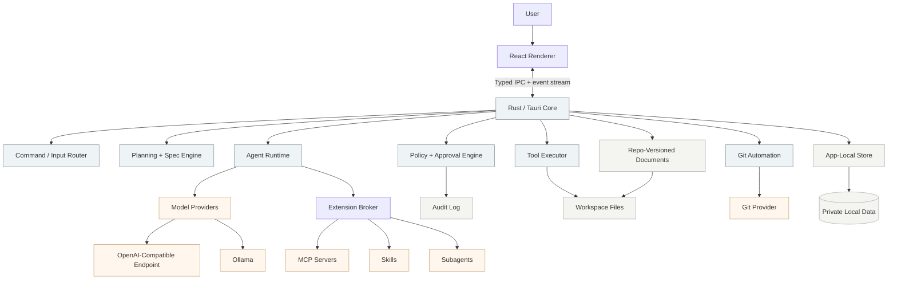
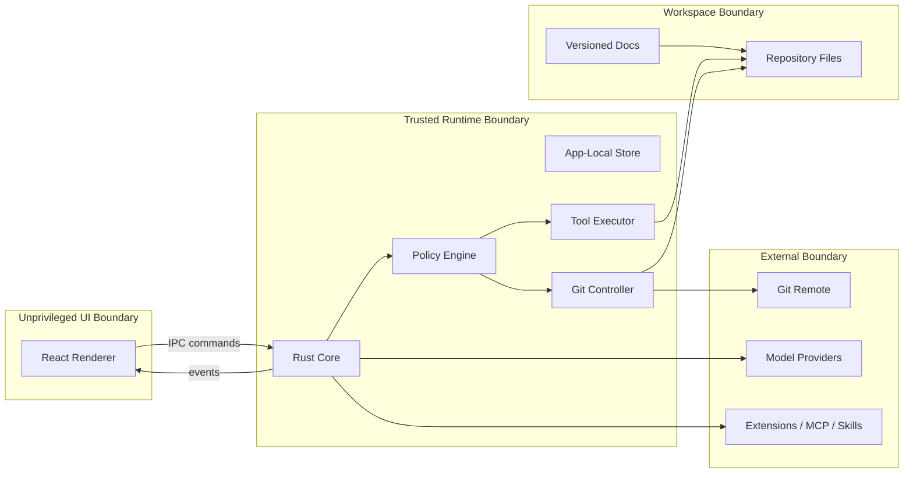

# Synth ERD / HLSA

**Version:** 0.1.0  
**Status:** Draft for review  
**Product:** Synth  
**Document type:** Entity Relationship Design and High-Level System Architecture  
**Companion document:** [`../PRD.md`](../PRD.md)  

---

## 1. Purpose

This document defines Synth's initial engineering baseline: the core entities, relationships, runtime boundaries, storage posture, and high-level architecture required to deliver the documents-first, spec-to-PR workflow described in the PRD.

It is intentionally a product-level engineering design rather than a final database schema. Synth is still in its planning baseline phase. The goal is to define the conceptual model clearly enough that feature specs can later produce concrete storage schemas, Rust modules, IPC contracts, and migrations without re-litigating the product architecture.

---

## 2. Architectural premise

Synth is a local-first desktop application with a Rust-native trusted runtime and a thin React renderer.

```text
React renderer = visual surface
Rust/Tauri core = trusted product kernel
External processes = supervised extension/tool boundary
Repo docs = committed project truth
App-local store = private operational truth
```

The runtime owns all privileged operations. Models, extensions, tools, and workflows may request actions, but the trusted core enforces policy before anything touches the filesystem, shell, network, credentials, git state, or project documents.

---

## 3. High-level system architecture



### 3.1 Renderer responsibilities

The React renderer is deliberately thin. It renders state, captures input, and subscribes to runtime events.

Responsibilities:

- command-native shell;
- reader/session/diff/render views;
- command palette;
- approval and amendment overlays;
- keyboard navigation;
- event-stream rendering;
- user input capture.

The renderer does not perform privileged filesystem, shell, network, credential, git, or provider operations directly.

### 3.2 Rust/Tauri core responsibilities

The Rust core is the trusted product kernel.

Responsibilities:

- request classification;
- planning gate enforcement;
- PRD/ERD/spec/ADR workflow orchestration;
- model provider abstraction;
- agent loop;
- context assembly and compaction;
- workspace jail;
- policy decisions;
- approval lifecycle;
- command execution;
- file read/write/edit/search tools;
- git branch/commit/PR orchestration;
- event store;
- session tree;
- audit logging;
- process-based extension supervision.

### 3.3 External process responsibilities

External processes may provide capability, but not authority.

Examples:

- MCP servers;
- skills;
- custom tools;
- subagents;
- local model servers;
- git provider CLIs or APIs.

All extension activity is routed through the core policy broker and logged with extension identity.

---

## 4. Trust boundaries



Core rules:

1. The model proposes tool calls; the core enforces policy.
2. The renderer never bypasses the core for privileged operations.
3. External processes never receive unrestricted workspace authority.
4. Out-of-workspace writes, destructive commands, credential access, network access, and high-risk operations require policy evaluation and approval.
5. High-autonomy mode reduces routine interruption, not trust enforcement.
6. Amendment approval is always blocking.

---

## 5. Storage model

Synth has two storage domains.

### 5.1 Repo-versioned project truth

Committed documents live in the repository under `docs/`.

```text
docs/PRD.md
docs/engineering/ERD.md
docs/engineering/HLSA.md                # optional future split if needed
docs/specs/<spec-id>/spec.md
docs/specs/<spec-id>/amendments/*.md
docs/adrs/ADR-*.md
docs/releases/<release-id>.md
docs/knowledge/*.md
```

These artifacts are reviewable through normal git workflows and governed by CODEOWNERS once setup is complete.

### 5.2 App-local private operational truth

Private operational state lives outside the repo by default.

Examples:

- raw transcripts;
- tool-call logs;
- approval records;
- audit logs;
- provider metadata;
- credentials;
- session replay data;
- loop/stall/sentiment metadata;
- local eval results.

Users can explicitly export redacted bundles when needed.

---

## 6. Core entity model

The entity model is grouped by domain. Concrete persistence may use SQLite, append-only event logs, markdown frontmatter, JSON sidecars, or a hybrid model, but the relationships below define the product contract.

### 6.1 Workspace and project entities

| Entity | Description | Storage domain |
| --- | --- | --- |
| `Workspace` | A local working area opened by Synth. | App-local |
| `Project` | A repository-backed product/system being worked on. | App-local index + repo docs |
| `Repository` | Git repository metadata and remote configuration. | App-local + git |
| `CodeOwnerRule` | Ownership rule for docs/code paths. Mirrors CODEOWNERS. | Repo-versioned |
| `DocumentationDecision` | Saved acceptance/decline/defer decision for optional docs. | Repo-versioned or app-local by scope |

Relationships:

```text
Workspace 1─* Project
Project 1─1 Repository
Project 1─* CodeOwnerRule
Project 1─* DocumentationDecision
```

### 6.2 Planning and document entities

| Entity | Description | Storage domain |
| --- | --- | --- |
| `Document` | A PRD, ERD/HLSA, ADR, release, spec, amendment, or knowledge doc. | Repo-versioned |
| `DocumentVersion` | Immutable version metadata for a document. | Repo-versioned |
| `PlanningBaseline` | The approved PRD + ERD/HLSA baseline for project-level work. | Repo-versioned |
| `ADR` | Material decision record. | Repo-versioned |
| `PullRequest` | Planning or implementation PR metadata. | Git provider + app-local index |

Relationships:

```text
Project 1─* Document
Document 1─* DocumentVersion
Project 1─* PlanningBaseline
PlanningBaseline 1─1 PRD Document
PlanningBaseline 1─1 ERD/HLSA Document
PlanningBaseline 1─* ADR
PlanningBaseline 1─1 PullRequest
```

### 6.3 Release, epic, and feature spec entities

| Entity | Description | Storage domain |
| --- | --- | --- |
| `Release` | Grouping for multiple story-sized specs. | Repo-versioned |
| `FeatureSpec` | Story-sized implementation contract. | Repo-versioned |
| `Requirement` | Requirement inside a feature spec. | Repo-versioned |
| `AcceptanceCriterion` | Testable acceptance statement. | Repo-versioned |
| `SuccessCriterion` | Definition of success for project/spec. | Repo-versioned |
| `Metric` | Measurement used to evaluate success. | Repo-versioned |
| `TestPlan` | Verification plan for the spec. | Repo-versioned |
| `Amendment` | Approved change to immutable spec. | Repo-versioned |
| `Task` | Implementation task derived from a spec. | App-local + optional repo summary |

Relationships:

```text
Project 1─* Release
Release 1─* FeatureSpec
Project 1─* FeatureSpec
FeatureSpec 1─* Requirement
FeatureSpec 1─* AcceptanceCriterion
FeatureSpec 1─* SuccessCriterion
FeatureSpec 1─* Metric
FeatureSpec 1─1 TestPlan
FeatureSpec 1─* Amendment
FeatureSpec 1─* Task
FeatureSpec 1─* ADR
FeatureSpec 1─1 Implementation PullRequest
```

Rules:

- A `FeatureSpec` is immutable once approved.
- A spec is story-sized; larger work is represented as `Release` + many `FeatureSpec` records.
- Any material in-flight deviation creates an `Amendment` and pauses work until approval.

### 6.4 Session and runtime entities

| Entity | Description | Storage domain |
| --- | --- | --- |
| `Session` | Conversation/workflow execution context. | App-local |
| `SessionBranch` | Branch in the session tree. | App-local |
| `Message` | User/model/system/tool message. | App-local |
| `CompactionSummary` | Structured summary checkpoint. | App-local |
| `ModelProvider` | Provider configuration. | App-local secure config |
| `ModelRoleAssignment` | Model assignment by role. | App-local + project config |
| `ModelRun` | A provider request/response lifecycle. | App-local |

Relationships:

```text
Project 1─* Session
Session 1─* SessionBranch
SessionBranch 1─* Message
SessionBranch 1─* CompactionSummary
Session 1─* ModelRun
Project 1─* ModelRoleAssignment
ModelProvider 1─* ModelRoleAssignment
ModelRun *─1 ModelProvider
```

Rules:

- Sessions are trees, not flat transcripts.
- Compaction summaries preserve exact paths, decisions, errors, and next steps.
- Model role assignments support default model plus role overrides.

### 6.5 Tool, policy, and observability entities

| Entity | Description | Storage domain |
| --- | --- | --- |
| `ToolCall` | Requested tool invocation. | App-local event store |
| `ToolResult` | Result of a tool call. | App-local event store |
| `Approval` | User approval/denial/remembered policy decision. | App-local |
| `PolicyDecision` | Machine policy evaluation. | App-local |
| `AuditEvent` | Security/audit event. | App-local |
| `RuntimeEvent` | Typed event emitted by the runtime. | App-local |
| `ReviewFinding` | Finding from adversarial or human review. | App-local + PR/spec summary |

Relationships:

```text
Session 1─* RuntimeEvent
Message 1─* ToolCall
ToolCall 1─1 ToolResult
ToolCall 0─1 Approval
ToolCall 1─1 PolicyDecision
PolicyDecision 1─* AuditEvent
FeatureSpec 1─* ReviewFinding
PullRequest 1─* ReviewFinding
```

Rules:

- Tool calls are observable from request through result.
- High-risk tool calls require approval.
- Errors, loops, stalls, interruptions, negative sentiment, amendments, and review findings become improvement signals.

### 6.6 Git entities

| Entity | Description | Storage domain |
| --- | --- | --- |
| `GitBranch` | Branch created or used by Synth. | Git + app-local index |
| `GitCommit` | Logical commit associated with docs/spec/tasks. | Git + app-local index |
| `Diff` | Working tree or commit diff. | Git + app-local cache |
| `PullRequest` | PR raised for planning baseline or feature spec. | Git provider + app-local index |

Relationships:

```text
PlanningBaseline 1─1 GitBranch
PlanningBaseline 1─* GitCommit
PlanningBaseline 1─1 PullRequest
FeatureSpec 1─1 GitBranch
FeatureSpec 1─* GitCommit
FeatureSpec 1─* Diff
FeatureSpec 1─1 PullRequest
PullRequest 1─* GitCommit
```

Rules:

- Project-level implementation is blocked until the planning PR is merged.
- Each feature spec gets its own branch and PR.
- Logical commits trace back to specs/tasks.

### 6.7 Extensibility and workflow entities

| Entity | Description | Storage domain |
| --- | --- | --- |
| `Extension` | External process integration. | App-local + project config |
| `CapabilityGrant` | Permission/capability granted to an extension. | App-local |
| `Workflow` | Deterministic workflow definition. | Repo-versioned or app-local by scope |
| `WorkflowNode` | Node in a workflow graph. | Same as workflow |
| `WorkflowEdge` | Edge/data dependency in workflow graph. | Same as workflow |
| `WorkflowRun` | Execution of a workflow. | App-local |
| `KnowledgeConcept` | OKF-style markdown knowledge unit. | Repo-versioned |

Relationships:

```text
Project 1─* Extension
Extension 1─* CapabilityGrant
Project 1─* Workflow
Workflow 1─* WorkflowNode
Workflow 1─* WorkflowEdge
Workflow 1─* WorkflowRun
WorkflowRun 1─* RuntimeEvent
Project 1─* KnowledgeConcept
KnowledgeConcept *─* KnowledgeConcept
```

Rules:

- Extensions are process-based and supervised by the Rust core.
- Workflow builder is a roadmap feature, but the data model should not block it.
- Knowledge concepts use markdown + YAML frontmatter and cross-links.

---

## 7. Conceptual ERD

```mermaid
erDiagram
  WORKSPACE ||--o{ PROJECT : contains
  PROJECT ||--|| REPOSITORY : uses
  PROJECT ||--o{ CODE_OWNER_RULE : defines
  PROJECT ||--o{ DOCUMENTATION_DECISION : records

  PROJECT ||--o{ DOCUMENT : owns
  DOCUMENT ||--o{ DOCUMENT_VERSION : versions
  PROJECT ||--o{ PLANNING_BASELINE : approves
  PLANNING_BASELINE ||--|| DOCUMENT : has_prd
  PLANNING_BASELINE ||--|| DOCUMENT : has_erd_hlsa
  PLANNING_BASELINE ||--o{ ADR : records
  PLANNING_BASELINE ||--|| PULL_REQUEST : reviewed_by

  PROJECT ||--o{ RELEASE : groups
  RELEASE ||--o{ FEATURE_SPEC : decomposes_to
  PROJECT ||--o{ FEATURE_SPEC : owns
  FEATURE_SPEC ||--o{ REQUIREMENT : contains
  FEATURE_SPEC ||--o{ ACCEPTANCE_CRITERION : contains
  FEATURE_SPEC ||--o{ SUCCESS_CRITERION : defines
  FEATURE_SPEC ||--o{ METRIC : measured_by
  FEATURE_SPEC ||--|| TEST_PLAN : verifies_with
  FEATURE_SPEC ||--o{ AMENDMENT : amended_by
  FEATURE_SPEC ||--o{ TASK : decomposes_to
  FEATURE_SPEC ||--o{ ADR : records
  FEATURE_SPEC ||--|| PULL_REQUEST : completed_by

  PROJECT ||--o{ SESSION : has
  SESSION ||--o{ SESSION_BRANCH : branches
  SESSION_BRANCH ||--o{ MESSAGE : contains
  SESSION_BRANCH ||--o{ COMPACTION_SUMMARY : checkpoints
  SESSION ||--o{ MODEL_RUN : invokes
  MODEL_PROVIDER ||--o{ MODEL_RUN : serves
  MODEL_PROVIDER ||--o{ MODEL_ROLE_ASSIGNMENT : assigned_to
  PROJECT ||--o{ MODEL_ROLE_ASSIGNMENT : configures

  MESSAGE ||--o{ TOOL_CALL : requests
  TOOL_CALL ||--|| TOOL_RESULT : returns
  TOOL_CALL ||--o| APPROVAL : may_require
  TOOL_CALL ||--|| POLICY_DECISION : evaluated_by
  POLICY_DECISION ||--o{ AUDIT_EVENT : emits
  SESSION ||--o{ RUNTIME_EVENT : emits

  FEATURE_SPEC ||--|| GIT_BRANCH : implemented_on
  FEATURE_SPEC ||--o{ GIT_COMMIT : produces
  FEATURE_SPEC ||--o{ DIFF : changes
  PULL_REQUEST ||--o{ GIT_COMMIT : includes
  PULL_REQUEST ||--o{ REVIEW_FINDING : includes
  FEATURE_SPEC ||--o{ REVIEW_FINDING : receives

  PROJECT ||--o{ EXTENSION : configures
  EXTENSION ||--o{ CAPABILITY_GRANT : receives
  PROJECT ||--o{ WORKFLOW : owns
  WORKFLOW ||--o{ WORKFLOW_NODE : contains
  WORKFLOW ||--o{ WORKFLOW_EDGE : connects
  WORKFLOW ||--o{ WORKFLOW_RUN : executes_as
  WORKFLOW_RUN ||--o{ RUNTIME_EVENT : emits

  PROJECT ||--o{ KNOWLEDGE_CONCEPT : contains
  KNOWLEDGE_CONCEPT }o--o{ KNOWLEDGE_CONCEPT : links_to
```



---

## 8. Primary lifecycle relationships

### 8.1 Project bootstrap lifecycle

```text
Workspace
→ Project
→ Repository
→ CodeOwnerRule
→ PRD Document
→ ERD/HLSA Document
→ ADRs
→ PlanningBaseline
→ Planning GitBranch
→ Planning PullRequest
→ merged planning baseline
```

Implementation is blocked until the planning PR is merged.

### 8.2 Feature implementation lifecycle

```text
Project or Release
→ FeatureSpec
→ Requirements / AcceptanceCriteria / SuccessCriteria / Metrics / TestPlan
→ ADRs
→ approval
→ GitBranch
→ Tasks
→ Sessions / ToolCalls / RuntimeEvents
→ Diffs
→ ReviewFindings
→ GitCommits
→ PullRequest
```

### 8.3 Amendment lifecycle

```text
Implementation deviation
→ RuntimeEvent
→ Amendment draft
→ user approval gate
→ approved Amendment
→ updated task/check plan
→ resumed implementation
→ deviation metadata for improvement
```

---

## 9. Success criteria and metrics model

Success criteria and metrics are first-class planning entities.

Required at project level:

- project success criteria;
- metrics used to evaluate success;
- verification method;
- review owner.

Required at feature-spec level:

- feature success criteria;
- metrics used to evaluate success;
- verification method;
- review owner.

Metrics are linked to specs and PR evidence. A feature is not complete because code exists; it is complete when the approved acceptance criteria and success metrics have evidence.

---

## 10. Open design decisions for later feature specs

The following are intentionally not finalized in this ERD and should be resolved by future feature specs:

1. Exact app-local storage engine.
2. Concrete event serialization format.
3. Markdown frontmatter schema for each document type.
4. Provider capability schema.
5. IPC event envelope shape.
6. Git provider integration strategy for PR creation.
7. Extension manifest schema.
8. Workflow graph schema.
9. Secret storage implementation details per platform.

These are implementation-level design choices. This ERD fixes the product model and relationships they must support.
